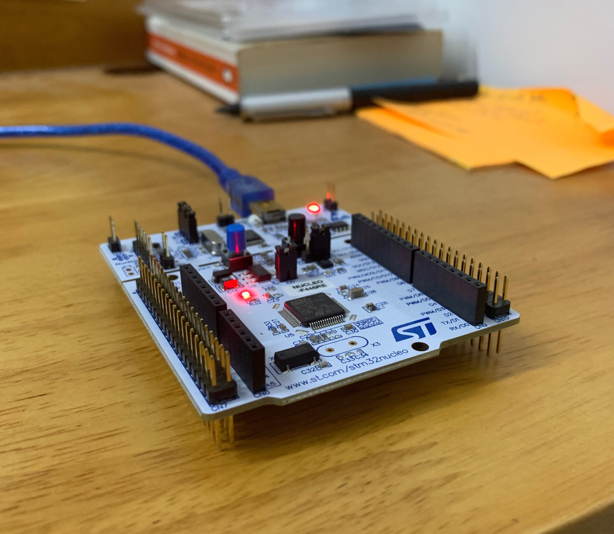

# MCU-Development-STM32
This repository contains the modules covered in the course - Mastering Microcontroller with Embedded Driver Development | Udemy. The development board used is STM NUCLEO-F446RE. 

  

Index

- 
-  